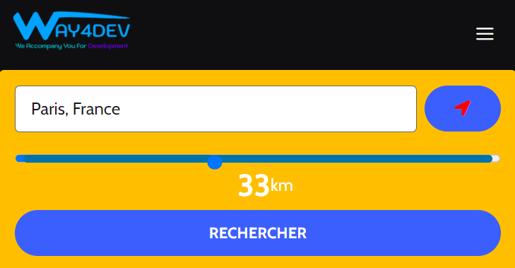

# Geofiltre Plugin

**Plugin Name:** Geofiltre Plugin  
**Description:** Plugin pour ajouter une recherche basée sur la géolocalisation.  
**Version:** 2.0  
**Author:** BELAID Yasser  

## Description

Le plugin Geofiltre permet d'ajouter une fonctionnalité de recherche basée sur la géolocalisation dans votre site WordPress. Les utilisateurs peuvent rechercher des articles dans un rayon spécifié autour d'une adresse donnée ou de leur propre position géolocalisée.

## Fonctionnalités

- Recherche basée sur la géolocalisation.
- Utilisation de l'API Google Maps pour l'autocomplétion des adresses et la géolocalisation.
- Options de personnalisation dans le backend pour ajuster les paramètres de recherche et d'affichage des résultats.
- Affichage des résultats sous forme de grille responsive avec pagination.
- Personnalisation de l'interface utilisateur et des messages via le backend.

## Exigences

- **Advanced Custom Fields (ACF) Plugin**: Le plugin ACF doit être installé et activé pour que le plugin Geofiltre fonctionne correctement.
- **Clé API Google Maps**: Vous devez fournir une clé API Google Maps dans les paramètres du plugin Geofiltre. Ce plugin gère l'intégration de la clé API dans ACF automatiquement.

## Installation

1. Téléchargez le fichier `geofiltre-plugin.zip`.
2. Allez dans le tableau de bord WordPress > Extensions > Ajouter.
3. Téléversez le fichier `geofiltre-plugin.zip` et activez l'extension.

## Configuration

1. Allez dans "Geofiltre" dans le menu d'administration.
2. Configurez les paramètres suivants :
   - **Clé API Google Maps**: Entrez votre clé API Google Maps. Le plugin s'occupe de l'intégration avec ACF.
   - **Rayon par défaut, minimum et maximum**: Définissez les valeurs pour le rayon de recherche.
   - **Textes et étiquettes**: Personnalisez les textes des boutons, des messages d'erreur, et autres éléments.
   - **Affichage des résultats**: Choisissez quels éléments afficher dans les résultats de recherche (miniatures, extraits, auteurs, etc.).

## Utilisation

Ajoutez le shortcode `[search_form]` dans une page ou un article pour afficher le formulaire de recherche géolocalisée.

## Captures d'écran

1. **Formulaire de recherche**
   

2. **Résultats de la recherche**
   

## Contribuer

Les contributions sont les bienvenues ! Vous pouvez contribuer en soumettant un pull request ou en signalant des problèmes dans la section des issues.

## Auteur

**BELAID Yasser**

## Licence

Ce projet est sous licence MIT. Voir le fichier [LICENSE](LICENSE) pour plus d'informations.

## Changelog

### 2.0
- Ajout de la fonctionnalité de recherche géolocalisée.
- Personnalisation via le backend.
- Affichage responsive des résultats.

### 1.0
- Version initiale.

---

# Geofiltre Plugin

**Plugin Name:** Geofiltre Plugin  
**Description:** Plugin to add a geolocation-based search functionality.  
**Version:** 2.0  
**Author:** BELAID Yasser  

## Description

The Geofiltre plugin allows you to add a geolocation-based search functionality to your WordPress site. Users can search for articles within a specified radius around a given address or their own geolocated position.

## Features

- Geolocation-based search.
- Use of the Google Maps API for address autocomplete and geolocation.
- Customization options in the backend to adjust search and result display settings.
- Display results in a responsive grid with pagination.
- Customization of the user interface and messages via the backend.

## Requirements

- **Advanced Custom Fields (ACF) Plugin**: The ACF plugin must be installed and activated for the Geofiltre plugin to work properly.
- **Google Maps API Key**: You must provide a Google Maps API key in the Geofiltre plugin settings. This plugin handles the integration of the API key with ACF automatically.

## Installation

1. Download the `geofiltre-plugin.zip` file.
2. Go to the WordPress dashboard > Plugins > Add New.
3. Upload the `geofiltre-plugin.zip` file and activate the plugin.

## Configuration

1. Go to "Geofiltre" in the admin menu.
2. Configure the following settings:
   - **Google Maps API Key**: Enter your Google Maps API key. The plugin handles the integration with ACF.
   - **Default, Minimum, and Maximum Radius**: Set the values for the search radius.
   - **Texts and Labels**: Customize the texts for buttons, error messages, and other elements.
   - **Result Display**: Choose which elements to display in the search results (thumbnails, excerpts, authors, etc.).

## Usage

Add the shortcode `[search_form]` to a page or post to display the geolocation search form.

## Screenshots

1. **Search Form**
   

2. **Search Results**
   

## Contributing

Contributions are welcome! You can contribute by submitting a pull request or by reporting issues in the issues section.

## Author

**BELAID Yasser**

## License

This project is licensed under the MIT License. See the [LICENSE](LICENSE) file for more details.

## Changelog

### 2.0
- Added geolocation search functionality.
- Customization via the backend.
- Responsive display of results.

### 1.0
- Initial release.
